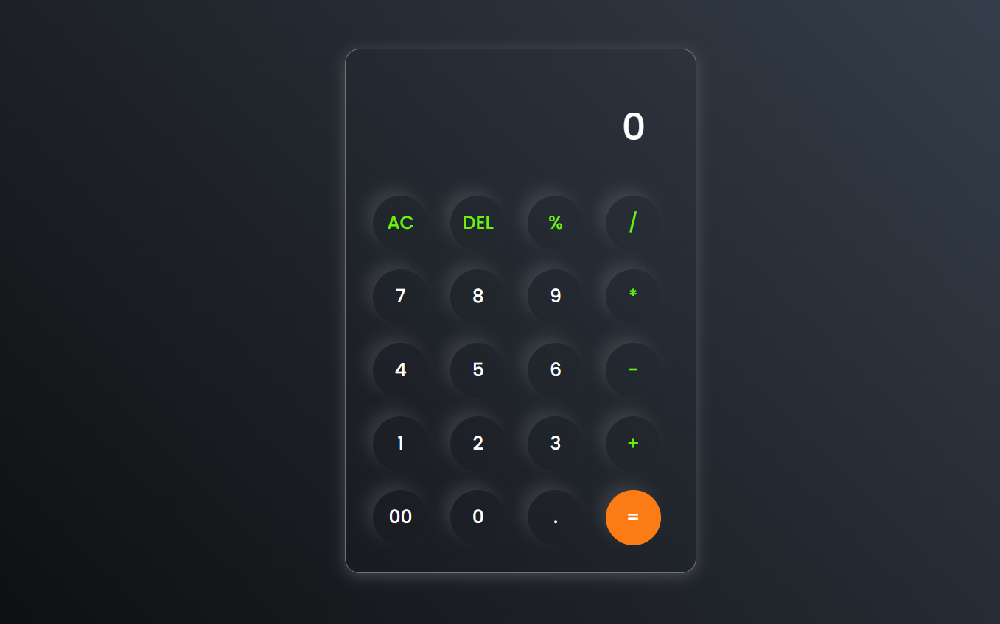

# Simple Javascript Calculator🧮

## Overview
The Simple JavaScript Calculator is a straightforward web-based calculator built using JavaScript. 
It provides basic arithmetic operations to help users perform calculations quickly and efficiently.

## Usage
You can access the Simple JavaScript Calculator by visiting the following link: [Simple JavaScript Calculator](https://vishalgiri8767.github.io/Simple-Javascript-Calculator/)  
Simply enter your mathematical expressions and use the calculator's features to perform calculations with ease.

